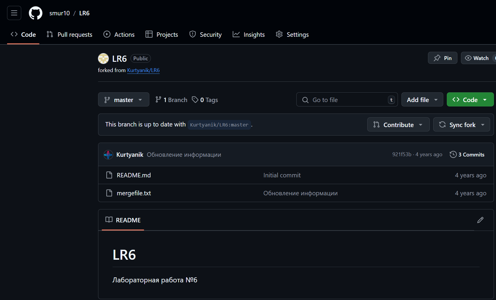
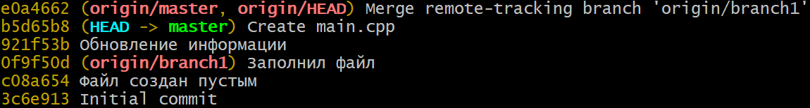
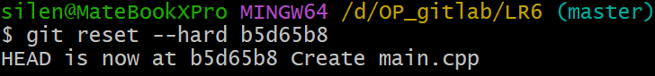
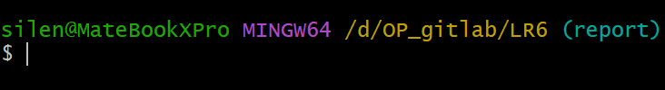
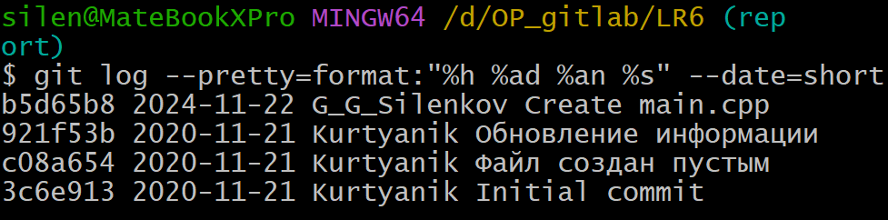

# LR6
Лабораторная работа №6

# Отчет по работе с Git

## 1. Создание форка
*Скриншот с созданием форка*  


## 2. Установка Git
*Уже скачан на ПК*  

## 3. Изменение имени пользователя
Команда для изменения имени пользователя:

```bash
$ git config --global user.name "IgorYao4317"
```

## 4. Клонирование репозитория

```bash
$ git clone https://github.com/smur10/LR6
```

## 5. Добавление нового файла
*Скриншет с добавлением нового файла*


## 6. Добавление изменений в локальный репозиторий

```bash
$ git pull
```

## 7. Получение данных для каждой из веток

```bash
$ git log --all –-oneline
```

*Результат работы команды*


## 8. Просмотр последних изменений

```bash
$ git log -1
```

*Результат работы команды*


## 9. Решение конфликта и слияние веток

```bash
$ git checkout master
$ git merge origin/branch1
```

Открыл merge.txt с помощью nano и изменил содержимое файла

```
nano mergefile.txt
```

## 10. Удаление побочной ветки после слияния

```bash
$ git branch -d branch1
```

## 11. Откат коммита
Посмотреть логи с помощью команды:

```bash
$ git log --all –oneline
```



Откат к предыдущему коммиту:

```bash
$ git reset --hard b5d65b8
```



## 12. Создание ветки для отчета

```bash
$ git checkout -b report
```

*Переход к созданной ветке*



## 13. Получение истории операций в форматированном виде

```bash
$ git log --pretty=format:"%h %ad %an %s" --date=short
```

*Список истории операций:*

